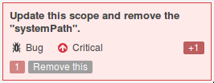

# jdk.compiler

### What

Maven repackaging of part of OpenJDK's langtools, for the [Compiler](http://openjdk.java.net/groups/compiler/).

Available for Java 8, the repackaging mirrors the Java 9 module structure for **jdk.compiler**, using the contents of jdk8's langtools. 

### Why

When you include the JDK's tools.jar in your Maven POM:

                <dependency>
                        <groupId>com.sun</groupId>
                        <artifactId>tools</artifactId>
                        <version>${version.java}</version>
                        <scope>system</scope>
                        <systemPath>${java.home}/../lib/tools.jar</systemPath>
                </dependency>

[SonarQube](https://www.sonarqube.org/) 6.4 will display (Squid [S3422](https://sonarcloud.io/organizations/default/rules#rule_key=squid%3AS3422)):

Instead you may replace with:

				<dependency>
					<groupId>io.earcam.wrapped</groupId>
					<artifactId>jdk.compiler</artifactId>
					<version>1.8.132</version>
					<scope>provided</scope>
					<optional>true</optional>
				</dependency>

## Miscellaneous

Need something else from `tools.jar`? There's another project [com.sun.tools.attach](https://bitbucket.org/earcam/com.sun.tools.attach) repackaging `com.sun.tools.attach` and `com.sun.tools.attach.spi` as a Maven dependency.  (This may be out-of-date, so check Maven central for the groupId [io.earcam.wrapped](http://search.maven.org/#search|ga|1|g%3A%22io.earcam.wrapped%22), for other possible libraries wrapped for Maven).

To build run with `mvn -P '!strict' clean install'`,  the javadoc generation takes ages as it generates tonnes of UML diagrams

## Status

## Supported JVMs

## Licences

